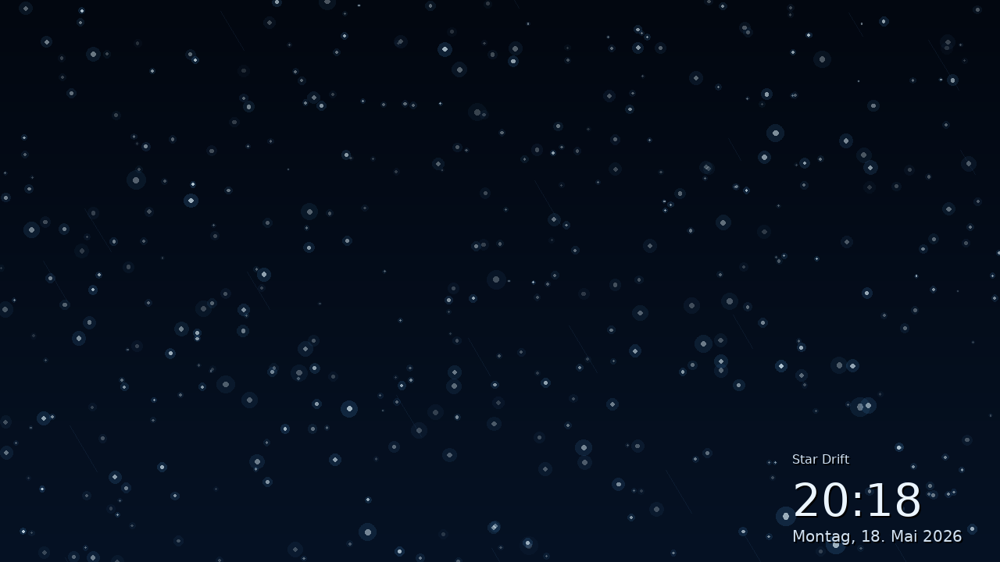

# SASD ScreenSaver Lab



**SASD ScreenSaver Lab** is a small experimental Windows desktop project for creating original screensaver and visualizer effects.

The goal is not to copy existing Apple, iTunes, After Dark, or other historic screensavers one-to-one. Instead, this project uses the general idea of animated visual effects as inspiration and builds its own SASD-style effects, names, palettes, and implementation.

## Current status

Version: **V0.4.1 prototype**

Implemented:

- A small Windows Forms host application
- A modular effect interface
- Built-in effect selection via command-line arguments
- `StarDriftEffect`
- `DataStreamEffect`
- `LightTrailsEffect`
- `AmberFeedEffect`
- Fullscreen mode
- Multi-monitor-aware startup
- Basic render loop
- Exit on keyboard, mouse button, or noticeable mouse movement
- Configurable clock overlay via command-line arguments
- Repository-ready README with screenshot
- Manpage-like `/help` command-line reference
- Optional power-management modes for keeping the system and/or display awake
- Initial GitHub Actions build workflow
- Initial project documentation

Not yet implemented:

- Real `.scr` packaging
- Configuration dialog
- Windows preview mode for the screensaver settings panel
- Friendly configuration UI for monitor, overlay and effect selection
- Audio-reactive visualizer mode
- Plugin loading from external assemblies
- Real RSS/Atom item retrieval and cache refresh for `AmberFeedEffect`

## Intended technology stack

- C#
- .NET 8
- Windows Forms
- Later possibly SkiaSharp, WPF, OpenTK, Silk.NET, or WebView2 depending on the visual direction

## Project structure

```text
SASD-ScreenSaverLab/
  README.md
  LICENSE
  .github/
    workflows/
      dotnet-build.yml
  docs/
    010_Project_Concept.md
    020_Roadmap.md
    030_Technical_Design.md
    040_Effect_Ideas.md
    050_GitHub_Repository_Setup.md
    060_Configuration.md
    070_Command_Line_Reference.md
    080_Power_Management.md
    090_Amber_Feed.md
    screenshots/
      sasd-screensaverlab-star-drift.png
  config/
    feeds.json
  src/
    Sasd.ScreenSaverLab.App/
    Sasd.ScreenSaverLab.Core/
    Sasd.ScreenSaverLab.Effects/
```

## Build and run

Open `Sasd.ScreenSaverLab.sln` in Visual Studio 2022.

Recommended startup project:

```text
src/Sasd.ScreenSaverLab.App/Sasd.ScreenSaverLab.App.csproj
```

Or run from the command line on Windows with the .NET SDK installed:

```powershell
dotnet run --project src/Sasd.ScreenSaverLab.App/Sasd.ScreenSaverLab.App.csproj
```

The application currently starts in fullscreen mode. Press **Esc**, click the mouse, or move the mouse noticeably to close it.

### Effect selection

V0.4.1 contains four built-in effects:

- `star-drift`
- `data-stream`
- `light-trails`
- `amber-feed`

Useful examples:

```powershell
# Default effect.
dotnet run --project src/Sasd.ScreenSaverLab.App/Sasd.ScreenSaverLab.App.csproj -- /effect:star-drift

# Data Stream effect.
dotnet run --project src/Sasd.ScreenSaverLab.App/Sasd.ScreenSaverLab.App.csproj -- /effect:data-stream

# Short aliases for Data Stream.
dotnet run --project src/Sasd.ScreenSaverLab.App/Sasd.ScreenSaverLab.App.csproj -- /stream
dotnet run --project src/Sasd.ScreenSaverLab.App/Sasd.ScreenSaverLab.App.csproj -- /data

# Light Trails effect.
dotnet run --project src/Sasd.ScreenSaverLab.App/Sasd.ScreenSaverLab.App.csproj -- /effect:light-trails

# Short aliases for Light Trails.
dotnet run --project src/Sasd.ScreenSaverLab.App/Sasd.ScreenSaverLab.App.csproj -- /light
dotnet run --project src/Sasd.ScreenSaverLab.App/Sasd.ScreenSaverLab.App.csproj -- /trails

# Amber Feed retro terminal effect. It reads config/feeds.json and previews configured feed sources.
dotnet run --project src/Sasd.ScreenSaverLab.App/Sasd.ScreenSaverLab.App.csproj -- /effect:amber-feed

# Short aliases for Amber Feed.
dotnet run --project src/Sasd.ScreenSaverLab.App/Sasd.ScreenSaverLab.App.csproj -- /amber
dotnet run --project src/Sasd.ScreenSaverLab.App/Sasd.ScreenSaverLab.App.csproj -- /feed
```

Unknown effect names currently fall back to `StarDriftEffect` instead of crashing. A later configuration UI should show available effects explicitly.

### Amber Feed configuration preview

V0.4.1 adds the first real configuration step for `AmberFeedEffect`. The effect now tries to load and validate RSS/Atom source definitions from:

```text
config/feeds.json
```

The configured sources are shown as preview/status items in the amber retro terminal. The application does **not** download live RSS/Atom content yet. Real feed retrieval, cache handling and timeout-safe refreshes are planned for the next Amber Feed iteration.

You can also select a custom feed configuration file:

```powershell
dotnet run --project src/Sasd.ScreenSaverLab.App/Sasd.ScreenSaverLab.App.csproj -- /amber /feeds:config/feeds.json /no-clock
```

Supported aliases include:

```text
/feeds:<path>
/feed-config:<path>
/rss-config:<path>
/rss:<path>
```

See [`docs/090_Amber_Feed.md`](docs/090_Amber_Feed.md) for details.

### Multi-monitor startup

V0.1.1 and newer no longer blindly maximize on the Windows primary monitor. In normal development mode the application starts on the monitor that currently contains the mouse pointer.

Useful command-line examples:

```powershell
# Start on the monitor under the mouse pointer.
dotnet run --project src/Sasd.ScreenSaverLab.App/Sasd.ScreenSaverLab.App.csproj -- /mouse

# Start on screen index 1. Screen indices are zero-based and follow Screen.AllScreens.
dotnet run --project src/Sasd.ScreenSaverLab.App/Sasd.ScreenSaverLab.App.csproj -- /screen:1

# Start one fullscreen window on every connected monitor.
dotnet run --project src/Sasd.ScreenSaverLab.App/Sasd.ScreenSaverLab.App.csproj -- /all-screens

# Data Stream on all monitors without clock overlay.
dotnet run --project src/Sasd.ScreenSaverLab.App/Sasd.ScreenSaverLab.App.csproj -- /all-screens /effect:data-stream /no-clock
```

For the later real Windows screensaver mode (`/s`), the application is prepared to cover all connected monitors.

### Command-line help

V0.2.1 and newer include a short manpage-like command-line reference.

```powershell
dotnet run --project src/Sasd.ScreenSaverLab.App/Sasd.ScreenSaverLab.App.csproj -- /help
```

Supported help aliases:

```text
/help
/?
-h
--help
/man
/usage
```

See [`docs/070_Command_Line_Reference.md`](docs/070_Command_Line_Reference.md) for the same information in Markdown form.

### Power management

V0.2.2 adds optional keep-awake modes. The default behavior is intentionally conservative: SASD ScreenSaver Lab respects the active Windows power plan and does not prevent sleep unless explicitly requested.

Useful examples:

```powershell
# Default behavior: Windows power plan remains in control.
dotnet run --project src/Sasd.ScreenSaverLab.App/Sasd.ScreenSaverLab.App.csproj -- /allow-sleep

# Keep the PC awake while the screensaver is running.
dotnet run --project src/Sasd.ScreenSaverLab.App/Sasd.ScreenSaverLab.App.csproj -- /stream /keep-awake

# Keep both PC and display awake, useful for demos or dashboards.
dotnet run --project src/Sasd.ScreenSaverLab.App/Sasd.ScreenSaverLab.App.csproj -- /stream /no-clock /keep-display-awake
```

The implementation uses the official Windows `SetThreadExecutionState` API instead of moving the mouse artificially.

See [`docs/080_Power_Management.md`](docs/080_Power_Management.md) for details.

### Clock overlay

V0.1.3 and newer can show or hide the built-in clock/date/effect-name overlay via command-line arguments. The overlay is enabled by default.

Useful examples:

```powershell
# Start with the clock overlay enabled. This is also the default.
dotnet run --project src/Sasd.ScreenSaverLab.App/Sasd.ScreenSaverLab.App.csproj -- /clock

# Start without the clock/date/effect-name overlay.
dotnet run --project src/Sasd.ScreenSaverLab.App/Sasd.ScreenSaverLab.App.csproj -- /no-clock

# Equivalent explicit forms.
dotnet run --project src/Sasd.ScreenSaverLab.App/Sasd.ScreenSaverLab.App.csproj -- /clock:on
dotnet run --project src/Sasd.ScreenSaverLab.App/Sasd.ScreenSaverLab.App.csproj -- /clock:off
```

The current implementation keeps this deliberately simple. A graphical settings dialog can later write the same options into a persistent configuration file.

## Design principle

V0.4.1 deliberately avoids a heavy plugin architecture. Effects are modular inside the solution, and a small built-in effect factory selects them by name. External plugin loading is postponed until there are several real effects and a clearer need for it.

This keeps the first versions small, understandable, and robust.

## Repository notes

Suggested repository name:

```text
SASD-ScreenSaverLab
```

Suggested GitHub topics:

```text
csharp dotnet windows-forms screensaver visualizer graphics animation sasd
```

See [`docs/050_GitHub_Repository_Setup.md`](docs/050_GitHub_Repository_Setup.md) for suggested GitHub setup commands.
